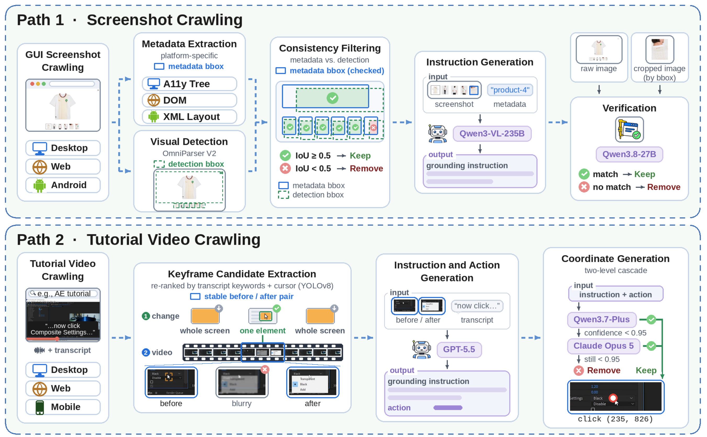
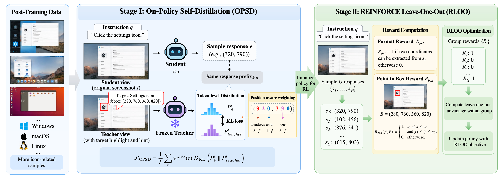

<div align="center">

# GroundGUI: GUI Grounding by High-Quality Data and Distillation-to-Reinforcement Learning

<p>
  <a href="https://huggingface.co/datasets/PrentisAI/ScreenRef"></a>
  <a href="https://huggingface.co/PrentisAI/GroundGUI-8B"></a>
  <a href="./LICENSE"></a>
</p>

<p><strong>Paper:</strong> arXiv link pending.</p>

<p>
  <a href="#overview">Overview</a> ·
  <a href="#screenref-dataset">Dataset</a> ·
  <a href="#d2rl-distillation-to-reinforcement-learning">Method</a> ·
  <a href="#results">Results</a> ·
  <a href="#getting-started">Getting Started</a> ·
  <a href="#training">Training</a> ·
  <a href="#evaluation">Evaluation</a>
</p>

</div>

---

<a id="overview"></a>

## 📖 Overview

**ScreenRef is the core contribution of GroundGUI:** a high-quality GUI grounding dataset spanning **desktop, web, and mobile** environments. It pairs diverse screenshots with referring expressions and localization annotations, covering text recognition, visual matching, spatial understanding, and refusal.

Building on ScreenRef, we train **GroundGUI-8B** from **Qwen3-VL-8B-Instruct** with supervised fine-tuning and **Distillation-to-Reinforcement Learning (D2RL)**, improving precise localization in complex interfaces.

### Key Features

#### 🗂️ High-Quality Cross-Platform Dataset

- **ScreenRef** provides **586K screenshots and 633K referring expressions** across desktop, web, and mobile interfaces.
- Two complementary collection pipelines combine screenshot crawling with tutorial video processing, followed by filtering and verification.
- Diverse supervision covers text recognition, visual matching, spatial understanding, and absent-target refusal.

#### 🧠 Distillation-to-Reinforcement Learning

- **OPSD** provides dense guidance from a frozen teacher with privileged target information, preparing a stronger starting policy for RL.
- **RLOO** then optimizes click success with a binary point-in-box reward, completing the **SFT → OPSD → RLOO** training pipeline.

#### 🌐 Cross-Platform Grounding

- **GroundGUI-8B** is evaluated on five benchmarks spanning general interfaces, professional software, and spatial reasoning.
- Consistent gains over Qwen3-VL-8B include **+14.0 percentage points on ScreenSpot-Pro** and **+20.8 on UI-Vision**.

<a id="screenref-dataset"></a>

## 🗂️ ScreenRef Dataset

**ScreenRef (Screen Referring Grounding Dataset)** pairs GUI screenshots with natural language referring expressions and bounding-box or point annotations.

### Dataset Features

- 📊 **Scale:** 585,981 screenshots and 633,369 referring expressions.
- 🖥️ **Coverage:** Desktop, web, and mobile interfaces from both screenshots and tutorial videos.
- ✅ **Quality:** Multi-stage filtering and model-based verification of instruction–target consistency.
- 🎯 **Capabilities:** Text recognition, visual matching, spatial understanding, and refusal.
- 📐 **Resolution:** Images range from 0.1 to 8.3 megapixels.
- 🛑 **Refusal Support:** 22,475 absent-target examples teach the model when to abstain.

### Data construction

The data is built through two complementary pipelines: **screenshot crawling** with metadata filtering and instruction verification, and **tutorial video processing** with keyframe extraction, action annotation, and visual grounding.

<p align="center">
  <a href="./assets/screenref-data-pipeline.png"></a>
  <br>
  <sub>ScreenRef data construction through screenshot crawling and tutorial video crawling. Click the figure to view it at full resolution.</sub>
</p>

### Grounding capabilities

| Capability | What the model learns | Instances |
| :--- | :--- | ---: |
| **Text recognition** | Locate an element by its visible text. | 319,293 |
| **Visual matching** | Identify a target by its icon, shape, or color. | 136,771 |
| **Spatial understanding** | Resolve relative positions and layout relationships. | 154,830 |
| **Refusal** | Abstain when the requested target is absent. | 22,475 |

### Platform distribution

| Platform | Text | Visual | Spatial | Refusal | Total |
| :--- | ---: | ---: | ---: | ---: | ---: |
| Desktop | 128,018 | 61,951 | 63,291 | 13,912 | 267,172 |
| Web | 167,115 | 62,294 | 67,799 | 6,582 | 303,790 |
| Mobile | 24,160 | 12,526 | 23,740 | 1,981 | 62,407 |
| **Total** | **319,293** | **136,771** | **154,830** | **22,475** | **633,369** |

### Data comparison: ScreenRef, GroundCUA, and ScaleCUA

Qwen3-VL-8B is fine-tuned on each dataset under its recommended settings. UI-Vision is excluded from this comparison because of source overlap with GroundCUA.

| SFT data | ScreenSpot-Pro | OSWorld-G | MMBench-GUI L2 | ScreenSpot-V2 | Average |
| :--- | ---: | ---: | ---: | ---: | ---: |
| ScaleCUA | 52.8 | 61.7 | 83.6 | 93.6 | 72.9 |
| GroundCUA | 58.5 | 59.6 | **84.9** | 91.9 | 73.7 |
| **ScreenRef** | **62.4** | **64.9** | 84.5 | **93.9** | **76.4** |

**[Explore ScreenRef on Hugging Face →](https://huggingface.co/datasets/PrentisAI/ScreenRef)**

<a id="d2rl-distillation-to-reinforcement-learning"></a>

## 🧠 D2RL: Distillation-to-Reinforcement Learning

After supervised fine-tuning on ScreenRef, **D2RL** strengthens the grounding policy in two stages: **on-policy self-distillation (OPSD)** provides dense teacher guidance, then **REINFORCE Leave-One-Out (RLOO)** optimizes click success.

<p align="center">
  <a href="./assets/d2rl-post-training.png"></a>
</p>

<a id="results"></a>

## 📊 Results

GroundGUI-8B improves over Qwen3-VL-8B on all five evaluated benchmarks and outperforms the larger Qwen3-VL-32B baseline in this comparison.

| Model | ScreenSpot-V2 | ScreenSpot-Pro | MMBench-GUI L2 | OSWorld-G | UI-Vision |
| :--- | ---: | ---: | ---: | ---: | ---: |
| Qwen3-VL-8B | 91.7 | 49.9 | 81.3 | 54.8 | 17.5 |
| Qwen3-VL-32B | 93.0 | 54.9 | 85.3 | 60.6 | 26.9 |
| **GroundGUI-8B** | **95.2** | **63.9** | **86.8** | **65.4** | **38.3** |
| **Gain over Qwen3-VL-8B** | **+3.5** | **+14.0** | **+5.5** | **+10.6** | **+20.8** |

<a id="getting-started"></a>

## 🚀 Getting Started

### 1. Get the code and resources

```bash
git clone https://github.com/PrentisAI/GroundGUI.git
cd GroundGUI
```

| Resource | Link | Use |
| :--- | :--- | :--- |
| **GroundGUI-8B** | [Model weights](https://huggingface.co/PrentisAI/GroundGUI-8B) | Download a checkpoint for evaluation. |
| **ScreenRef** | [Dataset](https://huggingface.co/datasets/PrentisAI/ScreenRef) | Prepare the training data. |
| **Qwen3-VL-8B-Instruct** | [Base model](https://huggingface.co/Qwen/Qwen3-VL-8B-Instruct) | Starting point for SFT and tokenizer template for checkpoint conversion. |

### 2. Prepare the stage-specific environments

The recorded environments use **Python 3.12.13**. Prepare a separate environment for each stage using its `requirements.lock.txt` as the version reference. These are environment snapshots with CUDA-specific packages and builds; use wheel sources and CUDA tooling appropriate to your GPU system.

| Stage | Dependency snapshot | Transformers | Environment variable |
| :--- | :--- | :--- | :--- |
| **SFT** | [`sft/requirements.lock.txt`](./sft/requirements.lock.txt) | `5.12.1` | `CONDA_ENV`: environment prefix |
| **OPSD / RLOO** | [`rl/requirements.lock.txt`](./rl/requirements.lock.txt) | `4.57.6` | `ENV_BIN`: environment's `bin/` directory |
| **Evaluation** | [`eval/requirements.lock.txt`](./eval/requirements.lock.txt) | `4.57.6` | `ENV_PREFIX`: environment prefix |

> **Keep these environments separate.** SFT requires Transformers 5.x for correct sequence packing; using 4.x can silently produce incorrect training. The RL and evaluation stacks use 4.57.6. Use the lock files above as the reference for the tested versions.

### 3. Prepare the data paths

- **SFT:** [`sft/configs/train_data_sft.json`](./sft/configs/train_data_sft.json) defines the data mix and format. Its `${DATA_ROOT}/...` paths are illustrative; adapt the configuration to your local ScreenRef layout.
- **Post-training:** set `DATASET` to the absolute path of your RL corpus in JSONL format.
- **Evaluation:** organize the benchmarks according to [`eval/dataset_info.template.json`](./eval/dataset_info.template.json). The evaluation wrapper creates `eval/dataset_info.json` from this template on its first run.

<a id="training"></a>

## 🏋️ Training

Run the commands below from the repository root and replace `/path/to/...` with your local paths. The paper uses **4 B300 GPUs for SFT** and **8 B300 GPUs for D2RL**, with **12K grounding samples** for post-training.

### Stage 1 · Supervised fine-tuning

```bash
CONDA_ENV="/path/to/sft-env" \
DATA_ROOT="/path/to/ScreenRef" \
GPUS=4 \
bash scripts/sft.sh out/sft "/path/to/Qwen3-VL-8B-Instruct"
```

The default data configuration is `sft/configs/train_data_sft.json`. Pass a custom configuration as the third argument to `scripts/sft.sh` if needed. Checkpoints are written to `out/sft/checkpoint-*`.

### Stages 2–3 · D2RL: OPSD followed by RLOO

```bash
export ENV_BIN="/path/to/rl-env/bin"
export DATASET="/path/to/rl-corpus.jsonl"

# Set this to the SFT checkpoint you want to continue from.
SFT_CHECKPOINT="/absolute/path/to/out/sft/checkpoint-N"

# Stage 2: distill from the privileged teacher.
bash scripts/opsd.sh "$SFT_CHECKPOINT" groundgui-opsd

# Stage 3: optimize click success from the OPSD checkpoint.
bash scripts/rloo.sh \
  rl/output/opsd+grpo/groundgui-opsd/checkpoint-200 \
  groundgui-d2rl
```

By default, the SFT checkpoint also initializes the frozen OPSD teacher.

<a id="evaluation"></a>

## 📏 Evaluation

The evaluation wrapper runs **ScreenSpot-V2, ScreenSpot-Pro, MMBench-GUI L2, UI-Vision, and OSWorld-G** sequentially with **vLLM at temperature 0**.

```bash
ENV_PREFIX="/path/to/eval-env" \
DATA_ROOT="/path/to/benchmarks" \
TP=2 \
bash scripts/eval.sh "/path/to/GroundGUI-8B" out/eval/groundgui-8b
```

Replace the checkpoint path with a downloaded GroundGUI-8B model directory or a local training checkpoint. Results are saved to `out/eval/groundgui-8b/<benchmark>/`.

To evaluate the D2RL run above:

```bash
ENV_PREFIX="/path/to/eval-env" \
DATA_ROOT="/path/to/benchmarks" \
bash scripts/eval.sh \
  rl/output/opsd+grpo/groundgui-d2rl/checkpoint-200 \
  out/eval/groundgui-d2rl
```

<a id="repository-structure"></a>

## 📂 Repository Structure

```text
GroundGUI/
├── assets/        # ScreenRef construction and D2RL method figures
├── scripts/       # Entry points: SFT, OPSD, RLOO, refusal SFT, evaluation
├── sft/           # Supervised fine-tuning and data configurations
├── rl/            # OPSD / RLOO training, based on GUI-SD and ms-swift
├── eval/          # Grounding benchmarks, prompts, and re-scoring
├── tools/         # Checkpoint conversion and serving utilities
├── LICENSE        # Apache-2.0 code license
└── NOTICE         # Third-party attribution and modified-file inventory
```

<a id="acknowledgements"></a>

## 🙏 Acknowledgements

Our implementation builds on the following projects:

- [**Qwen3-VL**](https://github.com/QwenLM/Qwen3-VL) for the foundation vision-language model.
- [**ScaleCUA**](https://github.com/OpenGVLab/ScaleCUA) for the SFT codebase.
- [**GUI-SD**](https://github.com/zhangyan-ucas/GUI-SD-code) and [**ms-swift**](https://github.com/modelscope/ms-swift) for the post-training infrastructure.
- [**GroundCUA**](https://github.com/ServiceNow/GroundCUA) for the evaluation framework.

See [NOTICE](./NOTICE) for full attribution and the inventory of modified files.

<a id="license"></a>

## ⚖️ License

The code is licensed under [**Apache-2.0**](./LICENSE), except where noted in [NOTICE](./NOTICE). **ScreenRef is distributed under its own license** and is not covered by the repository's code license. Refer to the model and dataset pages for their respective terms.

<a id="citation"></a>

## 📚 Citation

The paper is titled **GroundGUI: GUI Grounding by High-Quality Data and Distillation-to-Reinforcement Learning**. The arXiv link and BibTeX entry will be added when the preprint is available.

---

<p align="center">
  <a href="https://huggingface.co/PrentisAI/GroundGUI-8B">🤗 GroundGUI-8B</a> &nbsp;·&nbsp;
  <a href="https://huggingface.co/datasets/PrentisAI/ScreenRef">🗂️ ScreenRef</a> &nbsp;·&nbsp;
  <a href="#groundgui-gui-grounding-by-high-quality-data-and-distillation-to-reinforcement-learning">Back to top ↑</a>
</p>
